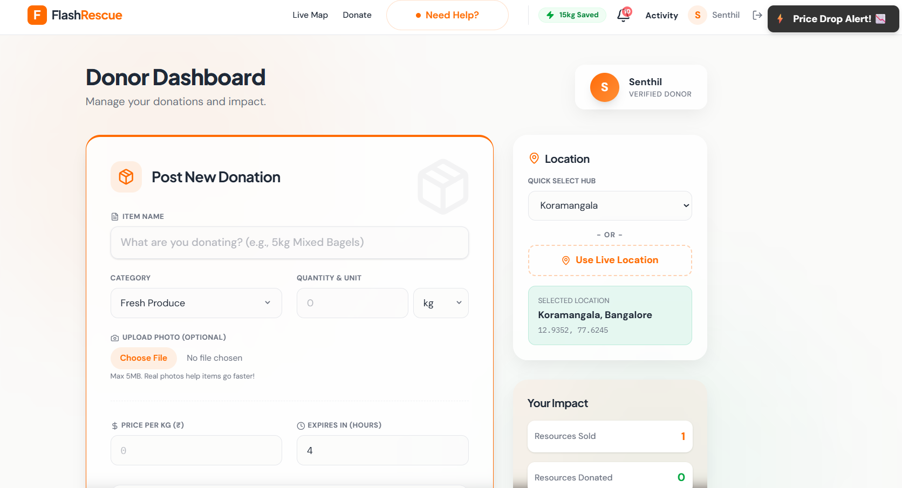
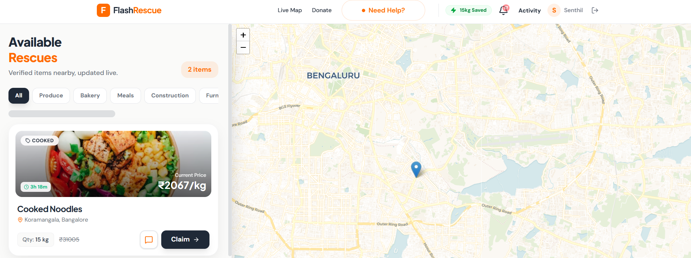
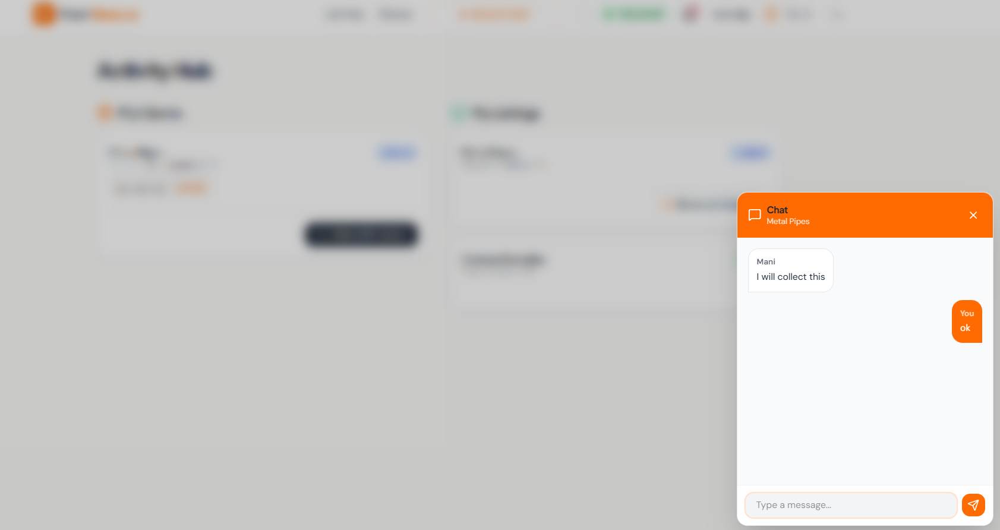
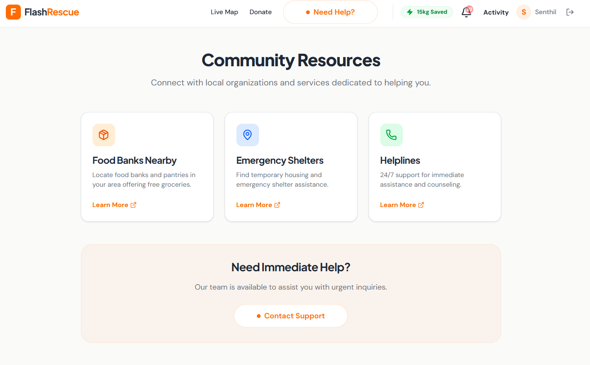

# ⚡ Flash-Rescue
> **Turning food waste into food rescue through dynamic, time-based pricing.**

[](https://opensource.org/licenses/MIT)
[](https://nodejs.org/)
[](https://reactjs.org/)
[]()

## 🌟 The Problem
Every day, perfectly good food is thrown away by retailers and restaurants because it can't be sold in time, while millions go hungry. The traditional donation process is often slow, manual, and uncoordinated. **Flash-Rescue** bridges this gap.

## 💡 The Solution
Flash-Rescue creates a win-win marketplace that accelerates food recovery:
1.  **Dynamic Pricing:** Items start at a base price and decay linearly to zero over a set time window.
2.  **Automated Rescue:** Once an item's price hits zero, it automatically flags as a donation.
3.  **Smart Routing:** NGOs are instantly notified with optimized routes to pick up free items.

---

## 📸 Screenshots

| Dashboard | Real-time Map |
|:---:|:---:|
|  |  |

| Listings | Mobile View |
|:---:|:---:|
|  |  |

*(More previews accessible in the generic gallery)*



---

## 🛠️ Tech Stack

**Frontend:**
-    **React 18** + Vite
-    **Tailwind CSS**
-    **Leaflet Maps**

**Backend:**
-    **Node.js** + Express
-    **MongoDB**
-    **Socket.io** (Real-time updates)

---

## 🚀 Getting Started

### Prerequisites
-   Node.js (v16+)
-   MongoDB (Local or Atlas URI)

### Installation

1.  **Clone the repository**
    ```bash
    git clone https://github.com/nothariharan/Flash_Rescue.git
    cd Flash_Rescue
    ```

2.  **Install Dependencies (Root, Client, & Server)**
    ```bash
    # Install server deps
    cd server
    npm install

    # Install client deps
    cd ../client
    npm install
    ```

3.  **Environment Setup**
    Create a `.env` file in the `server` directory:
    ```env
    PORT=5000
    MONGO_URI=your_mongodb_connection_string
    JWT_SECRET=your_jwt_secret
    ```

4.  **Run the Application**
    Open two terminals:

    *Terminal 1 (Server):*
    ```bash
    cd server
    npm run dev
    ```

    *Terminal 2 (Client):*
    ```bash
    cd client
    npm run dev
    ```

5.  Open [http://localhost:5173](http://localhost:5173) in your browser.

---

## ⚡ Challenges & Learnings
-   **Real-time Synchronization:** ensuring that the "current price" displayed on the map was exactly the same for every user using Socket.io.
-   **Race Conditions:** Handling simultaneous claims required robust database transactions.
-   **Map Clustering:** Implementing dynamic clustering to keep the UI clean with high data density.

## 🤝 Contributing
Contributions are welcome! Please open an issue or submit a pull request.

## 📄 License
This project is licensed under the MIT License.
